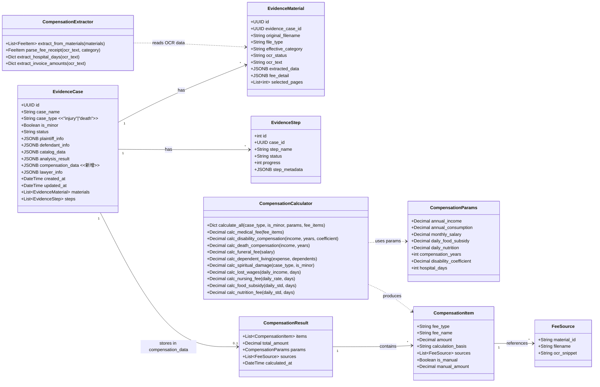
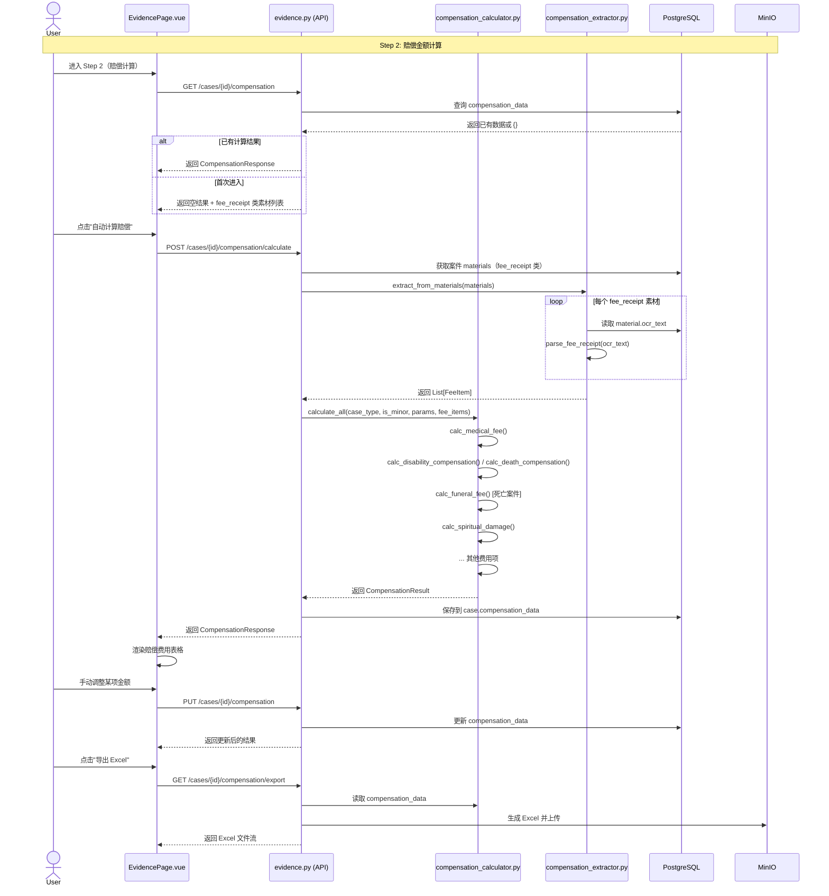
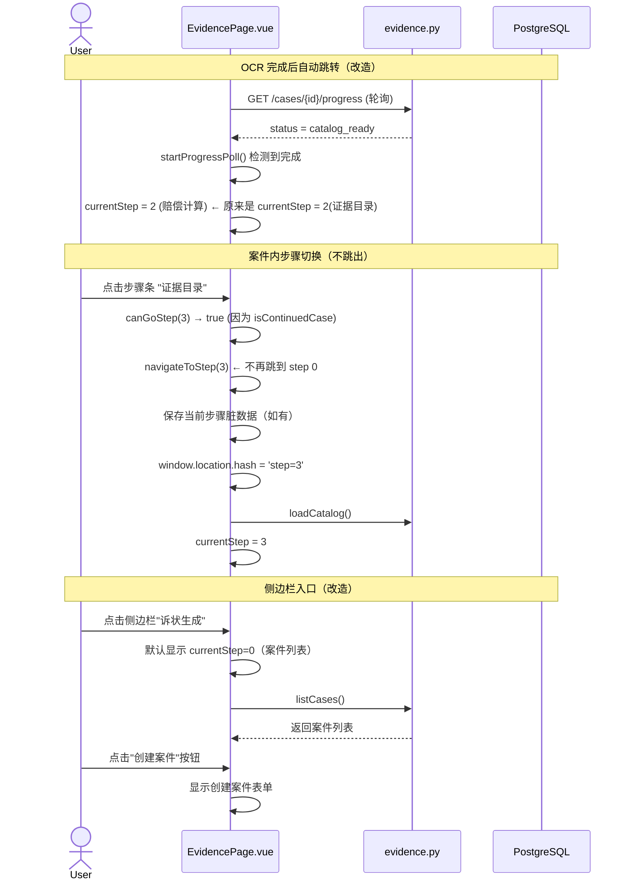
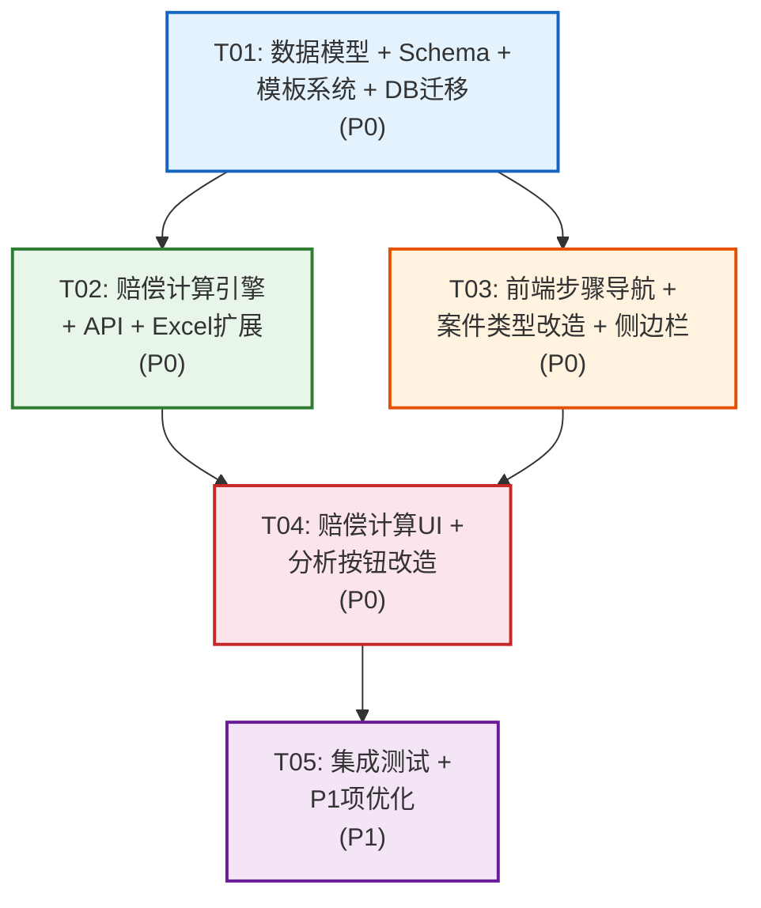

# 系统架构设计：OCRScanStruct 功能升级

| 字段 | 值 |
|------|-----|
| 文档版本 | v1.0 |
| 日期 | 2026-06-10 |
| 撰写人 | Bob (架构师) |
| 技术栈 | Vue 3 + Naive UI + TypeScript / Python FastAPI + PostgreSQL + Redis + Celery + MinIO |

---

## Part A: 系统设计

### 1. 实现方案

#### 1.1 核心技术挑战

| # | 挑战 | 难度 | 分析 |
|---|------|------|------|
| C1 | 步骤号全局变更 | ★★★ | `currentStep` 硬编码超过 30 处，涉及步骤条、导航、进度轮询、hash 路由，牵一发动全身 |
| C2 | 赔偿计算引擎 | ★★★★ | 涉及法律公式（伤残/死亡赔偿金、被扶养人生活费等），需精确的参数化计算 + OCR 数据自动提取 |
| C3 | 案件状态机扩展 | ★★★ | 新增 `compensation_ready` 状态，需兼容已有状态流转和进度计算 |
| C4 | 模板系统合并 | ★★ | 删除 neonatal 模板，6→4 套，需向后兼容旧数据 |
| C5 | 前端导航重构 | ★★ | 步骤条从 4→5 步，点击逻辑改为案件内切换，侧边栏入口变化 |

#### 1.2 框架与库选型

| 组件 | 选型 | 理由 |
|------|------|------|
| 前端框架 | Vue 3 + Naive UI | 项目已有，保持一致 |
| 后端框架 | FastAPI | 项目已有，异步支持好 |
| 数据库 | PostgreSQL | 项目已有，JSONB 支持灵活数据结构 |
| 任务队列 | Celery + Redis | 项目已有，用于赔偿计算的异步 OCR 提取 |
| OCR 引擎 | 已有 OCR 服务 | 赔偿提取复用已有 OCR 结果，不新增 OCR |
| 赔偿计算 | 纯 Python 实现 | 法律公式明确，无需 ML，使用 `Decimal` 精确计算 |
| Excel 生成 | openpyxl | 项目已有，扩展即可 |

#### 1.3 架构模式

沿用现有 **前后端分离 + 异步任务队列** 架构：
- **前端**：单页面应用，5 步工作流在 `EvidencePage.vue` 中以 `currentStep` 状态机控制
- **后端**：REST API + Celery Worker，新增赔偿计算服务层
- **数据流**：前端 → API → Service → Model → DB / MinIO

#### 1.4 步骤号变更映射（核心设计约束）

```
旧编号 → 新编号 → 步骤名称
  0   →   0    → 创建案件（含案件列表 + 创建表单）
  1   →   1    → 上传素材
  —   →   2    → 赔偿金额计算（新增，可选步骤）
  2   →   3    → 证据目录
  3   →   4    → 分析与导出
```

**前端 `currentStep` 编号常量化**：为避免再次硬编码，引入 `StepIndex` 枚举。

#### 1.5 待确认问题决策

| PRD 问题 | 决策 | 理由 |
|----------|------|------|
| Q3: OCR 完成后跳转目标 | 跳到 Step 2（赔偿计算） | 赔偿计算依赖 OCR 数据，符合自然工作流 |
| Q7: 赔偿计算是否可跳过 | 可跳过（可选步骤） | 某些案件可能不需要赔偿计算，不应阻塞后续流程 |
| Q6: 被扶养人信息来源 | 默认隐藏，用户手动添加时展示 | OCR 无法自动获取扶养人数量和年龄 |

---

### 2. 文件列表

#### 2.1 需要修改的文件（20 个）

```
# ─── 前端 (static/src/) ───────────────────────────────
views/EvidencePage.vue                      # 主页面：步骤条 4→5, 步骤号 +1, 新增 Step 2 区域, 分析按钮改造, 导航重构
api/evidence.ts                             # API 客户端：CaseType 去掉 neonatal, 新增赔偿计算 API
layouts/AdminLayout.vue                     # 侧边栏：调整菜单结构
router/index.ts                             # 路由：无需改动（单页面路由）

# ─── 后端 API 层 ──────────────────────────────────────
api/routes/evidence.py                      # API 路由：新增赔偿计算端点, 状态机扩展
api/schemas/evidence.py                     # Schema：case_type 去掉 neonatal, 新增赔偿计算 Schema

# ─── 后端数据层 ──────────────────────────────────────
db/models_evidence.py                       # 模型：case_type 约束变更, 新增 compensation_data 字段

# ─── 后端服务层 ──────────────────────────────────────
services/complaint/template_manager.py      # 模板：删除 neonatal 分支, get_template_key() 简化
services/evidence/excel_generator.py        # Excel：扩展赔偿计算结果导出
services/evidence/document_analyzer.py      # 分析器：使用新模板键名

# ─── 迁移与配置 ──────────────────────────────────────
migrations/versions/xxx_remove_neonatal_add_compensation.py  # 数据库迁移
```

#### 2.2 需要新建的文件（3 个）

```
# ─── 后端服务层（新增） ──────────────────────────────
services/evidence/compensation_calculator.py   # 赔偿计算引擎核心
services/evidence/compensation_extractor.py     # OCR 数据自动提取（从 fee_receipt 素材）
```

#### 2.3 完整文件影响矩阵

| 文件 | 变更类型 | 影响的需求 |
|------|----------|------------|
| `views/EvidencePage.vue` | **重大修改** | P0-1/2/3/5/7/8/11, 步骤号全局变更 |
| `api/evidence.ts` | 修改 | P0-4/8, 新增赔偿计算 API |
| `layouts/AdminLayout.vue` | 修改 | P0-3 |
| `api/routes/evidence.py` | 修改 | P0-8/9/10/12, 状态机扩展 |
| `api/schemas/evidence.py` | 修改 | P0-4, 新增 Schema |
| `db/models_evidence.py` | 修改 | P0-4/7, 新增字段 |
| `services/complaint/template_manager.py` | 修改 | P0-6 |
| `services/evidence/excel_generator.py` | 修改 | P0-12 |
| `services/evidence/document_analyzer.py` | 修改 | P0-6（间接） |
| `services/evidence/compensation_calculator.py` | **新建** | P0-10 |
| `services/evidence/compensation_extractor.py` | **新建** | P0-9 |
| `migrations/versions/xxx_*.py` | **新建** | P0-4/7, P1-2 |

---

### 3. 数据结构与接口设计

#### 3.1 类图



#### 3.2 数据库变更

##### EvidenceCase 表变更

```sql
-- 1. case_type 约束：移除 neonatal
ALTER TABLE evidence_cases DROP CONSTRAINT ck_evidence_cases_case_type;
ALTER TABLE evidence_cases ADD CONSTRAINT ck_evidence_cases_case_type
  CHECK (case_type IN ('injury', 'death'));

-- 2. 迁移已有 neonatal 数据
UPDATE evidence_cases
SET case_type = 'injury', is_minor = TRUE
WHERE case_type = 'neonatal';

-- 3. 新增 compensation_data 字段（赔偿计算结果）
ALTER TABLE evidence_cases
ADD COLUMN compensation_data JSONB NOT NULL DEFAULT '{}';
COMMENT ON COLUMN evidence_cases.compensation_data IS '赔偿金额计算结果 JSON';
```

##### compensation_data JSON 结构

```json
{
  "items": [
    {
      "fee_type": "medical_fee",
      "fee_name": "医疗费",
      "amount": 52300.00,
      "manual_amount": null,
      "calculation_basis": "3份发票合计",
      "is_manual": false,
      "sources": [
        {
          "material_id": "uuid-xxx",
          "filename": "发票001.jpg",
          "ocr_snippet": "合计金额：32,100.00元"
        }
      ]
    }
  ],
  "total_amount": 353000.00,
  "params": {
    "annual_income": 49283,
    "annual_consumption": 33382,
    "monthly_salary": 8500,
    "daily_food_subsidy": 100,
    "daily_nutrition": 30,
    "compensation_years": 20,
    "disability_coefficient": 1.0,
    "hospital_days": 60
  },
  "calculated_at": "2026-06-10T12:00:00Z"
}
```

#### 3.3 新增 API 接口

| 方法 | 路径 | 说明 | 对应 P0 |
|------|------|------|---------|
| `POST` | `/evidence/cases/{id}/compensation/calculate` | 自动提取 + 计算赔偿费用 | P0-9/10 |
| `GET` | `/evidence/cases/{id}/compensation` | 获取赔偿计算结果 | P0-8 |
| `PUT` | `/evidence/cases/{id}/compensation` | 保存手动调整的赔偿数据 | P0-11 |
| `GET` | `/evidence/cases/{id}/compensation/export` | 导出赔偿计算 Excel | P0-12 |

##### 计算请求/响应 Schema

```python
class CompensationCalculateRequest(BaseModel):
    """手动触发计算（可选传入覆盖参数）"""
    params: Optional[CompensationParamsUpdate] = None  # 覆盖默认参数

class CompensationParamsUpdate(BaseModel):
    annual_income: Optional[Decimal] = None       # 上年度人均可支配收入
    annual_consumption: Optional[Decimal] = None   # 上年度人均消费支出
    monthly_salary: Optional[Decimal] = None       # 上年度职工月均工资
    daily_food_subsidy: Optional[Decimal] = None   # 住院伙食补助日标准
    daily_nutrition: Optional[Decimal] = None      # 营养费日标准
    compensation_years: Optional[int] = None       # 赔偿年限
    disability_coefficient: Optional[Decimal] = None  # 伤残系数 (0.1-1.0)
    hospital_days: Optional[int] = None            # 住院天数

class CompensationUpdateRequest(BaseModel):
    """保存手动调整"""
    items: List[CompensationItemUpdate]
    params: Optional[CompensationParamsUpdate] = None

class CompensationItemUpdate(BaseModel):
    fee_type: str
    manual_amount: Optional[Decimal] = None  # null=使用自动计算值

class CompensationResponse(BaseModel):
    case_id: str
    items: List[CompensationItemResponse]
    total_amount: Decimal
    params: CompensationParamsResponse
    sources: List[FeeSourceResponse]
    calculated_at: Optional[datetime] = None
```

#### 3.4 案件状态机扩展

```
现有: draft → uploading → processing → catalog_ready → analyzing → analysis_done → completed
                                                                                         ↘ failed

新增: draft → uploading → processing → catalog_ready
                                           ↓ (新增)
                                    compensation_ready  ← 可选步骤，可跳过
                                           ↓
                                      [Step 3: 证据目录] (原 Step 2)
                                           ↓
                                      analyzing → analysis_done → completed
```

**状态映射更新**：
```python
# api/routes/evidence.py - get_progress() 中的 status_progress_map 新增:
"compensation_ready": 65.0,  # 在 catalog_ready(60) 和 analyzing(75) 之间
```

**进度百分比映射**（更新后）：
```
draft: 0% → uploading: 5% → processing: 30% → catalog_ready: 60%
→ compensation_ready: 65% → analyzing: 75% → analysis_done: 90% → completed: 100%
```

---

### 4. 程序调用流程

#### 4.1 赔偿计算主流程（时序图）



#### 4.2 步骤导航流程（改造后）



#### 4.3 智能分析按钮状态改造流程

```mermaid
sequenceDiagram
    actor User
    participant FE as EvidencePage.vue (Step 4)
    participant API as evidence.py
    participant Worker as Celery Worker

    Note over User, Worker: 分析按钮状态机

    FE->>FE: 进入 Step 4
    FE->>API: GET /cases/{id}/analysis
    API-->>FE: 返回当前分析状态

    alt 未分析 (status=catalog_ready)
        FE->>FE: 显示"开始智能分析"（可点击）
    else 分析中 (status=analyzing)
        FE->>FE: 按钮显示 loading + "分析中..."
    else 分析完成 (status=analysis_done/completed)
        FE->>FE: "开始智能分析" disabled
        FE->>FE: 显示"再次智能分析"按钮
    else 分析失败 (status=failed)
        FE->>FE: 显示"重新分析"（可点击）
    end

    User->>FE: 点击"再次智能分析"
    FE->>FE: 弹出确认对话框："重新分析将覆盖已有分析结果，是否继续？"
    User->>FE: 确认
    FE->>API: POST /cases/{id}/analyze
    API->>API: _cleanup_all_exports(case) ← 清理旧导出
    API->>Worker: analyze_evidence.delay(case_id)
    API-->>FE: task_id

    FE->>FE: 按钮显示 loading
    loop 轮询分析状态
        FE->>API: GET /cases/{id}/analysis
        API-->>FE: status
    until status == analysis_done
    
    FE->>FE: "开始智能分析" disabled
    FE->>FE: 显示"再次智能分析"按钮 + 分析结果
```

---

### 5. 待明确事项

| # | 事项 | 影响范围 | 建议 |
|---|------|----------|------|
| 1 | 赔偿计算中"年度标准参数"的默认值来源 | `CompensationParams` | 首期硬编码 2025 年度全国统一标准，后续迭代接入统计局数据 API |
| 2 | 伤残系数的初始值来源 | `CompensationParams` | 默认 100%（一级伤残），用户可手动调整为 10%-100% |
| 3 | 住院天数提取准确性 | `CompensationExtractor` | OCR 提取后用户可手动覆盖，前端提供"住院天数"输入框 |
| 4 | 被扶养人生活费的 UI 入口 | 前端 Step 2 | 默认隐藏，增加"添加被扶养人"按钮，展开后填写人数和年龄 |
| 5 | neonatal 模板的 Prompt 内容 | `template_manager.py` | 新生儿特殊内容（Apgar、NICU等）通过 `injury_minor` 模板的条件 Prompt 实现，由 LLM 根据素材自动判断 |
| 6 | 赔偿计算步骤持久化时机 | 前后端 | 每次手动调整后自动保存到 `compensation_data`，无需额外"保存"按钮 |

---

## Part B: 任务分解

### 6. 依赖包

```
# 后端（均为项目已有，无新增依赖）
- fastapi: ^0.100.0             # Web 框架
- sqlalchemy: ^2.0              # ORM
- pydantic: ^2.0                # Schema 验证
- celery: ^5.3                  # 异步任务队列
- redis: ^5.0                   # Celery broker
- openpyxl: ^3.1                # Excel 生成
- psycopg2-binary: ^2.9         # PostgreSQL 驱动
- alembic: ^1.12                # 数据库迁移

# 前端（均为项目已有，无新增依赖）
- vue: ^3.4                     # UI 框架
- naive-ui: ^2.38               # 组件库
- typescript: ^5.0              # 类型系统
- @vicons/ionicons5: ^0.0       # 图标库
```

**无需新增任何第三方依赖包。**

---

### 7. 任务列表

#### T01: 项目基础设施与数据层改造

| 字段 | 值 |
|------|-----|
| **Task ID** | T01 |
| **Task Name** | 数据模型 + Schema + 模板系统 + 数据库迁移 |
| **优先级** | P0 |
| **依赖** | 无 |
| **源文件** | `db/models_evidence.py`, `api/schemas/evidence.py`, `services/complaint/template_manager.py`, `migrations/versions/xxx_remove_neonatal_add_compensation.py` |

**详细说明**：

1. **`db/models_evidence.py`**:
   - `VALID_EVIDENCE_CASE_TYPES`: `'injury','death','neonatal'` → `'injury','death'`
   - `VALID_EVIDENCE_STATUSES`: 新增 `'compensation_ready'`
   - `EvidenceCase`: 新增 `compensation_data` JSONB 字段
   - `DEFAULT_REQUIREMENTS`: 移除 `case_type='neonatal'` 条目，改为 `case_type='injury', is_minor=True`

2. **`api/schemas/evidence.py`**:
   - `CreateEvidenceCaseRequest.case_type`: `Literal["injury", "death", "neonatal"]` → `Literal["injury", "death"]`
   - `UpdateCaseRequest.case_type`: 同上
   - 新增 `CompensationParamsUpdate`, `CompensationItemUpdate`, `CompensationUpdateRequest`, `CompensationResponse`, `CompensationItemResponse`, `FeeSourceResponse`, `CompensationParamsResponse` 等 Schema

3. **`services/complaint/template_manager.py`**:
   - 删除 `TEMPLATE_REGISTRY` 中的 `neonatal_adult` 和 `neonatal_minor` 条目
   - `get_template_key()`: 移除 `case_type == "neonatal"` 分支，neonatal 统一走 injury 路径
   - 文件顶部注释更新：`6 套模板` → `4 套模板`

4. **`migrations/versions/xxx_remove_neonatal_add_compensation.py`**:
   - Alembic 迁移脚本：
     - `UPDATE evidence_cases SET case_type='injury', is_minor=TRUE WHERE case_type='neonatal'`
     - `ALTER TABLE evidence_cases DROP CONSTRAINT ck_evidence_cases_case_type`
     - `ALTER TABLE evidence_cases ADD CONSTRAINT ck_evidence_cases_case_type CHECK (case_type IN ('injury', 'death'))`
     - `ALTER TABLE evidence_cases ADD COLUMN compensation_data JSONB NOT NULL DEFAULT '{}'`
     - 同步更新 `evidence_requirements` 表中 `case_type='neonatal'` 的数据

**验收标准**：
- [ ] 数据库迁移成功，neonatal 数据迁移为 injury+is_minor
- [ ] `get_template_key("injury", True)` 返回 `"injury_minor"`
- [ ] `get_template_key("death", False)` 返回 `"death_adult"`
- [ ] 旧 neonatal 案件的模板键正确映射
- [ ] 新建案件不再接受 neonatal 类型

---

#### T02: 赔偿计算引擎（后端核心）

| 字段 | 值 |
|------|-----|
| **Task ID** | T02 |
| **Task Name** | 赔偿计算服务 + API 路由 + Excel 扩展 |
| **优先级** | P0 |
| **依赖** | T01 |
| **源文件** | `services/evidence/compensation_calculator.py`（新建）, `services/evidence/compensation_extractor.py`（新建）, `api/routes/evidence.py`, `services/evidence/excel_generator.py` |

**详细说明**：

1. **`services/evidence/compensation_extractor.py`（新建）**:
   - `extract_from_materials(materials: List[EvidenceMaterial]) -> List[FeeItem]`
     - 过滤 `effective_category == 'fee_receipt'` 且 `ocr_status == 'completed'` 的素材
     - 解析 `ocr_text` 中的金额（正则提取发票合计、费用清单项目）
     - 解析住院天数（从病历/出院小结的 OCR 文本中提取）
   - `parse_fee_receipt(ocr_text: str) -> FeeItem`
     - 识别发票类型（住院发票、门诊发票、费用清单）
     - 提取总金额、医院名称、日期范围
   - `extract_hospital_days(ocr_text: str) -> int`
     - 从"住院XX天"、"入院日期-出院日期"等格式中提取

2. **`services/evidence/compensation_calculator.py`（新建）**:
   - 使用 `Decimal` 类型确保金额精度
   - 默认参数配置（2025 年度标准）：
     ```python
     DEFAULT_PARAMS = {
         "annual_income": Decimal("49283"),      # 上年度城镇居民人均可支配收入
         "annual_consumption": Decimal("33382"),  # 上年度城镇居民人均消费支出
         "monthly_salary": Decimal("8500"),       # 上年度职工月平均工资
         "daily_food_subsidy": Decimal("100"),    # 住院伙食补助日标准
         "daily_nutrition": Decimal("30"),        # 营养费日标准
         "compensation_years": 20,                # 赔偿年限（死亡/一级伤残=20年）
         "disability_coefficient": Decimal("1.0"), # 伤残系数（一级=100%）
     }
     ```
   - **伤残案件 8 项**：
     - `medical_fee`: 自动从 OCR 提取合计
     - `lost_wages`: 日均收入 × 误工天数（用户手动输入天数）
     - `nursing_fee`: 护理费日标准 × 住院天数
     - `food_subsidy`: 日标准 × 住院天数
     - `nutrition_fee`: 日标准 × 营养期天数
     - `disability_compensation`: 年收入 × 赔偿年限 × 伤残系数
     - `transport_fee`: 交通住宿费（手动输入）
     - `spiritual_damage`: 精神损害抚慰金（根据伤残等级，默认值）
   - **死亡案件 9 项**：
     - 与伤残相同的 5 项（医疗费、误工费、护理费、伙食补助、营养费）
     - `death_compensation`: 年收入 × 赔偿年限 × 100%（20年）
     - `funeral_fee`: 职工月均工资 × 6个月
     - `transport_fee`: 交通费（手动输入）
     - `spiritual_damage`: 精神损害抚慰金
   - **共同可选项**：
     - `dependent_living`: 人均消费支出 × 赔偿年限 × 扶养比例 ÷ 扶养人数（需手动添加被扶养人）
   - `calculate_all()` 主入口：根据 case_type 组装对应费用项列表

3. **`api/routes/evidence.py` 修改**:
   - 新增 4 个赔偿计算端点（见 3.3 节）
   - `get_progress()` 中 `status_progress_map` 新增 `compensation_ready: 65.0`
   - OCR 完成后的状态流转：`catalog_ready` → 前端跳转到 Step 2（赔偿计算）
   - 赔偿计算完成保存后：前端跳转到 Step 3（证据目录）
   - 注意：后端不强制状态流转到 `compensation_ready`，`catalog_ready` 状态可直接进入 `analyzing`（跳过赔偿计算）

4. **`services/evidence/excel_generator.py` 扩展**:
   - 新增 `generate_compensation_calculation_excel(compensation_data)` 函数
   - 生成包含以下列的 Excel：
     - 序号 | 赔偿项目 | 金额(元) | 计算依据 | 来源素材 | 是否手动调整
     - 合计行
   - 复用现有样式定义（`_HEADER_FONT`, `_CELL_FONT` 等）

**验收标准**：
- [ ] 给定 3 份 fee_receipt 素材的 OCR 文本，能正确提取医疗费金额
- [ ] 伤残案件计算出 8 项费用，死亡案件计算出 9 项费用
- [ ] `disability_compensation = 49283 × 20 × 1.0 = 985,660`（验证公式正确性）
- [ ] `death_compensation = 49283 × 20 = 985,660`
- [ ] `funeral_fee = 8500 × 6 = 51,000`
- [ ] 手动调整某项金额后，total_amount 实时重算
- [ ] 导出的 Excel 格式正确、样式美观
- [ ] 可跳过赔偿计算步骤直接进入证据目录

---

#### T03: 前端步骤导航 + 案件类型改造

| 字段 | 值 |
|------|-----|
| **Task ID** | T03 |
| **Task Name** | 步骤条扩展 + 导航逻辑重构 + 案件类型表单改造 + 侧边栏重构 |
| **优先级** | P0 |
| **依赖** | T01 |
| **源文件** | `views/EvidencePage.vue`, `api/evidence.ts`, `layouts/AdminLayout.vue` |

**详细说明**：

1. **`views/EvidencePage.vue` — 步骤号全局变更**（影响 30+ 处）:

   **引入步骤常量**（script 顶部）：
   ```typescript
   const STEP = {
     CREATE: 0,
     UPLOAD: 1,
     COMPENSATION: 2,  // 新增
     CATALOG: 3,       // 原 2
     ANALYSIS: 4,      // 原 3
   } as const
   ```
   
   **步骤条**：从 4 个 `<n-step>` 改为 5 个：
   ```html
   <n-step title="创建案件" ... />
   <n-step title="上传素材" ... />
   <n-step title="赔偿金额计算" ... />   <!-- 新增 -->
   <n-step title="证据目录" ... />
   <n-step title="分析与导出" ... />
   ```

   **步骤号变更清单**（所有硬编码位置）：
   | 位置 | 旧值 | 新值 |
   |------|------|------|
   | `n-card v-if="currentStep === 2"` (证据目录) | 2 | 3 |
   | `n-card v-if="currentStep === 3"` (分析与导出) | 3 | 4 |
   | `currentStep = 2` (OCR 完成跳转) | 2 | `STEP.COMPENSATION` (2) |
   | `currentStep = 3` (OCR→分析跳转) | 3 | `STEP.ANALYSIS` (4) |
   | `currentStep = 2` (返回按钮 Step3→2) | 2 | `STEP.CATALOG` (3) |
   | `currentStep = 3` (下一步 Step2→3) | 3 | `STEP.ANALYSIS` (4) |
   | `currentStep = 1` (返回 Step2→1) | 1 | 1 (不变) |
   | `currentStep = 2` (返回 Step3→2) | 2 | `STEP.CATALOG` (3) |
   | `handleHashChange()` step 范围校验 | `<= 3` | `<= 4` |
   | `navigateToStep()` step===2 分支 | goStep2() | goStep3() (证据目录) |
   | `navigateToStep()` step===3 分支 | goStep3() | goStep4() (分析导出) |
   | 新增 navigateToStep() step===2 分支 | — | goStep2() (赔偿计算) |
   | `canGoStep(0)` | 返回 true | 仅返回案件列表时不跳出（见下） |
   | `handleRefresh()` step===2||3 刷新 | 2||3 | 3||4 |

2. **导航逻辑重构**：

   **`canGoStep(step)` 改造**：
   ```typescript
   function canGoStep(step: number): boolean {
     // Step 0（创建案件/列表）：只有在用户主动"返回案件列表"时才允许
     // 案件内步骤条不显示 Step 0 的点击
     if (step === STEP.CREATE) return false  // 不允许通过步骤条跳回
     if (!currentCase.value || !isContinuedCase.value) return false
     return true  // Step 1-4 案件内自由切换
   }
   ```

   **`handleGoHome()` 改造**：
   - 改名为 `handleGoCaseList()`，按钮标签从"新建案件"改为"案件列表"
   - 重置状态并回到 Step 0（案件列表页）

   **顶部按钮区改造**：
   ```html
   <!-- 移除"新建案件"按钮，保留"刷新"和"案件列表" -->
   <n-button v-if="currentStep !== 0" @click="handleGoCaseList">案件列表</n-button>
   <n-button v-if="currentStep !== 0" @click="handleRefresh">刷新</n-button>
   ```

3. **Step 0（案件列表页）改造**：

   - 在案件列表表格上方增加 `[+ 创建案件]` 按钮
   - 点击后切换到创建案件表单（仍在 Step 0 内，通过 `showCreateForm` 状态控制）
   - 案件列表表格保留现有列和操作

   ```html
   <!-- Step 0: 案件列表 + 创建表单 -->
   <n-card v-if="currentStep === STEP.CREATE">
     <!-- 创建案件表单（默认隐藏，点按钮后显示） -->
     <n-card v-if="showCreateForm" title="创建证据案件">
       <!-- ... 现有表单 ... -->
       <template #action>
         <n-space>
           <n-button @click="showCreateForm = false">取消</n-button>
           <n-button type="primary" :loading="creating" @click="handleCreate">创建案件</n-button>
         </n-space>
       </template>
     </n-card>
   
     <!-- 案件列表 -->
     <n-card title="已有案件" :style="{ marginTop: showCreateForm ? '16px' : '0' }">
       <template #header-extra>
         <n-button type="primary" @click="showCreateForm = true">
           <template #icon><n-icon><AddOutline /></n-icon></template>
           创建案件
         </n-button>
       </template>
       <n-data-table ... />
     </n-card>
   </n-card>
   ```

4. **案件类型表单改造**：

   - 创建案件表单：移除 `neonatal` radio 选项
   - `is_minor` 开关标签：`"是否未成年人"` → `"是否未成年人（新生儿）"`
   - 编辑弹窗：同步移除 neonatal，修改开关标签
   - `caseTypeLabel()` 函数：移除 neonatal 分支
   - `form.value.case_type` 类型：移除 `'neonatal'`

5. **`api/evidence.ts` 改造**：
   - `CaseType`: `'injury' | 'death' | 'neonatal'` → `'injury' | 'death'`
   - 新增赔偿计算 API：
     ```typescript
     export async function calculateCompensation(caseId: string, params?: CompensationParamsUpdate): Promise<CompensationResponse>
     export async function getCompensation(caseId: string): Promise<CompensationResponse>
     export async function updateCompensation(caseId: string, data: CompensationUpdateRequest): Promise<CompensationResponse>
     export async function exportCompensationCalc(caseId: string): Promise<void>
     ```
   - 新增 TypeScript 类型定义

6. **`layouts/AdminLayout.vue` 改造**：
   - 侧边栏"诉状生成"菜单项保持不变（点击进入 `/evidence`，即 Step 0 案件列表）

**验收标准**：
- [ ] 步骤条显示 5 步，标题正确
- [ ] 创建案件表单只有 2 个类型选项，开关标签含"（新生儿）"
- [ ] 案件内点击步骤条不跳出，只在 1-4 步间切换
- [ ] Step 0 默认显示案件列表，有独立的"创建案件"按钮
- [ ] 编辑弹窗移除了 neonatal 选项
- [ ] URL hash `step=0~4` 全部有效
- [ ] 浏览器后退/前进正确响应步骤切换

---

#### T04: 赔偿计算前端步骤 + 智能分析按钮改造

| 字段 | 值 |
|------|-----|
| **Task ID** | T04 |
| **Task Name** | Step 2 赔偿计算 UI + Step 4 分析按钮状态改造 |
| **优先级** | P0 |
| **依赖** | T02, T03 |
| **源文件** | `views/EvidencePage.vue`, `api/evidence.ts` |

**详细说明**：

1. **Step 2（赔偿金额计算）UI 实现**（在 `EvidencePage.vue` 中新增 `v-if="currentStep === STEP.COMPENSATION"` 区域）：

   **布局结构**（对应 PRD 5.4 节）：
   ```
   ┌─ 赔偿金额计算 ─────────────────────────────────────────┐
   │                                                          │
   │  📎 相关素材（fee_receipt 类）              [折叠面板]    │
   │  ┌─────────────────────────────────────────────┐         │
   │  │ 发票001.jpg - 住院发票     [查看]            │         │
   │  │ 费用清单.pdf - 费用清单    [查看]            │         │
   │  └─────────────────────────────────────────────┘         │
   │                                                          │
   │  [自动计算赔偿]  [导出 Excel]                             │
   │                                                          │
   │  赔偿费用清单（n-table 可编辑）                            │
   │  ┌──────────┬──────────┬──────────┬──────────┐           │
   │  │ 项目     │ 金额(元) │ 计算依据 │ 来源素材  │           │
   │  ├──────────┼──────────┼──────────┼──────────┤           │
   │  │ 医疗费   │ 52,300   │ [编辑]   │ 3份发票   │           │
   │  │ ...      │ ...      │ [编辑]   │ ...      │           │
   │  ├──────────┼──────────┼──────────┼──────────┤           │
   │  │ 合计     │ 353,000  │          │          │           │
   │  └──────────┴──────────┴──────────┴──────────┘           │
   │                                                          │
   │  参数配置 [折叠]                                          │
   │  ┌─────────────────────────────────────────────┐         │
   │  │ 上一年度人均可支配收入: [49,283]              │         │
   │  │ ...                                         │         │
   │  │ 住院天数: [60]   伤残系数: [100%]            │         │
   │  └─────────────────────────────────────────────┘         │
   │                                                          │
   │  ─────────────────────────────────────────────────────   │
   │  [返回]                              [跳过 → 证据目录]    │
   └──────────────────────────────────────────────────────────┘
   ```

   **关键组件**：
   - 素材列表：`n-collapse` + `n-table`，只显示 `fee_receipt` 分类素材，每行有"查看"按钮（调用现有 `previewMaterialPages` 或直接用 `getExtractPageUrl`）
   - 自动计算按钮：调用 `POST /cases/{id}/compensation/calculate`
   - 费用表格：`n-table`，每行金额列为 `n-input-number`，失焦时调用 `PUT /cases/{id}/compensation` 自动保存
   - 合计行：实时计算（前端 `computed`）
   - 参数配置折叠面板：`n-collapse`，内含 `n-input-number` 表单项
   - 底部按钮：`[返回]` → Step 1，`[跳过 → 证据目录]` → Step 3
   - Excel 导出按钮

   **数据流**：
   ```typescript
   // 赔偿计算相关状态
   const compensationData = ref<CompensationResponse | null>(null)
   const calculatingCompensation = ref(false)
   const feeReceiptMaterials = computed(() =>
     materials.value.filter(m => m.effective_category === 'fee_receipt' && m.ocr_status === 'completed')
   )
   const compensationTotal = computed(() =>
     compensationData.value?.items.reduce((sum, item) =>
       sum + (item.manual_amount ?? item.amount), 0) ?? 0
   )
   ```

2. **Step 4（分析与导出）— 智能分析按钮改造**：

   **按钮状态机**：
   ```html
   <!-- 智能分析区域 -->
   <n-card size="small" title="智能分析" embedded>
     <!-- 未分析 / 分析失败 -->
     <n-button
       v-if="!hasAnalysisResult && !analyzing"
       type="primary"
       :loading="analyzing"
       @click="handleStartAnalysis"
     >
       {{ analysisFailed ? '重新分析' : '开始智能分析' }}
     </n-button>

     <!-- 分析中 -->
     <n-button
       v-if="analyzing"
       type="primary"
       loading
       disabled
     >
       分析中...
     </n-button>

     <!-- 分析完成 -->
     <template v-if="hasAnalysisResult && !analyzing">
       <n-space vertical>
         <n-tag type="success">分析完成</n-tag>
         <n-button
           type="warning"
           secondary
           @click="handleReAnalysis"
         >
           再次智能分析
         </n-button>
       </n-space>
     </template>
   </n-card>
   ```

   **`handleReAnalysis()` 实现**：
   ```typescript
   function handleReAnalysis() {
     dialog.warning({
       title: '确认重新分析',
       content: '重新分析将覆盖已有分析结果，是否继续？',
       positiveText: '确认重新分析',
       negativeText: '取消',
       onPositiveClick: () => handleStartAnalysis(),
     })
   }
   ```

   **`handleStartAnalysis()` 改造**：
   - 原有逻辑不变，但分析完成后按钮变为 disabled + 显示"再次智能分析"

   **新增计算属性**：
   ```typescript
   const hasAnalysisResult = computed(() => {
     const ar = analysisResult.value?.analysis_result
     return ar && Object.keys(ar).length > 0
   })
   const analysisFailed = computed(() => currentCase.value?.status === 'failed')
   ```

3. **`api/evidence.ts` 补充**：
   - `CaseType` 类型已去掉 neonatal（T03 中完成）
   - 新增赔偿计算相关接口和类型（T03 中已声明，此处实现具体调用）

**验收标准**：
- [ ] Step 2 显示 fee_receipt 类素材列表，可点击查看原始文件
- [ ] 点击"自动计算赔偿"后正确展示各项费用
- [ ] 手动修改金额后，合计实时更新，数据自动保存
- [ ] 参数配置面板可展开/折叠，修改参数后可重新计算
- [ ] "跳过"按钮直接跳到 Step 3（证据目录），不影响后续流程
- [ ] Excel 导出生成正确文件
- [ ] 分析按钮 4 种状态正确切换：未分析 / 分析中 / 分析完成 / 分析失败
- [ ] "再次智能分析"按钮仅分析完成后显示
- [ ] 点击"再次智能分析"弹出确认对话框
- [ ] 确认后清理旧导出文件，重新触发分析

---

#### T05: 集成测试 + P1 项优化

| 字段 | 值 |
|------|-----|
| **Task ID** | T05 |
| **Task Name** | 端到端集成 + 旧数据兼容 + 编辑弹窗同步 + 费用来源追溯 |
| **优先级** | P1 |
| **依赖** | T04 |
| **源文件** | `views/EvidencePage.vue`, `api/routes/evidence.py`, `api/schemas/evidence.py`, `services/evidence/compensation_calculator.py`, `services/evidence/compensation_extractor.py` |

**详细说明**：

1. **端到端集成测试**：
   - 验证完整 5 步工作流：创建 → 上传 → 赔偿计算 → 证据目录 → 分析导出
   - 验证跳过赔偿计算的路径：创建 → 上传 → 证据目录 → 分析导出
   - 验证已有案件（neonatal 类型）的数据兼容性
   - 验证浏览器后退/前进在所有步骤间正常工作
   - 验证进度轮询完成后跳转到正确的步骤

2. **P1-1: 编辑弹窗同步修改**：
   - `views/EvidencePage.vue` 中编辑弹窗（`showEditModal`）：
     - 移除 neonatal 选项
     - 修改开关标签为"是否未成年人（新生儿）"

3. **P1-2: 旧数据兼容处理**：
   - T01 中迁移脚本已处理数据库层
   - 前端 `caseTypeLabel()` 已移除 neonatal（T03 中完成）
   - 后端 `_build_case_out()` 中 `case_type` 已不包含 neonatal（T01 中完成）
   - 验证旧 neonatal 案件的继续/分析/导出功能正常

4. **P1-4: 费用来源追溯**（前端）：
   - 在 Step 2 费用表格的"来源素材"列中，点击可展开显示：
     - 来源文件名
     - OCR 关键片段（高亮金额部分）
   - 使用 `n-popover` 或 `n-tooltip` 展示来源详情

5. **P1-5: 赔偿计算步骤进度保存**：
   - 已通过 `PUT /cases/{id}/compensation` 自动保存到 `compensation_data`
   - 切换步骤或刷新页面后重新加载 `GET /cases/{id}/compensation`
   - 验证数据不丢失

6. **全局回归测试**：
   - 已有功能不受影响：
     - [ ] OCR + 分类 + 目录生成
     - [ ] 智能分析 + 导出（起诉状、立案证据等）
     - [ ] 一键打包下载
     - [ ] 多页文档预览与选择
     - [ ] 批量删除素材
     - [ ] 律师信息保存

**验收标准**：
- [ ] 全流程（5 步 + 跳过赔偿计算）端到端测试通过
- [ ] 旧 neonatal 案件可正常继续、分析、导出
- [ ] 编辑弹窗已同步修改
- [ ] 费用来源可追溯，显示 OCR 关键片段
- [ ] 赔偿计算结果持久化，刷新不丢失
- [ ] 所有已有功能回归测试通过

---

### 8. 共享知识

#### 8.1 步骤号常量

```typescript
// 前端统一使用常量，禁止硬编码数字
const STEP = { CREATE: 0, UPLOAD: 1, COMPENSATION: 2, CATALOG: 3, ANALYSIS: 4 } as const
const TOTAL_STEPS = 5
const MAX_STEP = 4
```

#### 8.2 API 响应格式

```typescript
// 所有 API 响应均为 JSON，格式遵循现有模式
// 成功：直接返回数据对象
// 失败：{ detail: "error message" } (HTTP 4xx/5xx)
```

#### 8.3 案件类型

```typescript
// 前后端统一：case_type 只接受 "injury" | "death"
// 旧数据 "neonatal" 已迁移为 "injury" + is_minor=true
type CaseType = 'injury' | 'death'
```

#### 8.4 模板键名映射

```python
# 后端统一规则：
# case_type + is_minor → template_key
# injury + False → injury_adult
# injury + True  → injury_minor
# death  + False → death_adult
# death  + True  → death_minor
# 旧 neonatal 统一走 injury 路径
```

#### 8.5 赔偿计算精度

```python
# 所有金额计算使用 Decimal 类型，避免浮点精度问题
from decimal import Decimal, ROUND_HALF_UP

# 金额显示保留 2 位小数
# 合计金额 = sum(各项), 不做额外取整
```

#### 8.6 赔偿计算为可选步骤

```
# 前端：Step 2 有"跳过"按钮，直接进入 Step 3
# 后端：不强制 status 从 catalog_ready → compensation_ready → analyzing
#       catalog_ready 状态可直接触发 analyzing
#       compensation_ready 是可选的中间状态
```

#### 8.7 数据库迁移策略

```sql
-- 迁移必须幂等（可重复执行不报错）
-- 使用 IF EXISTS / IF NOT EXISTS 保护
-- neonatal → injury+is_minor 的迁移在迁移脚本中完成，不依赖应用代码
```

---

### 9. 任务依赖图



**并行度分析**：
- T01 完成后，T02 和 T03 可**并行开发**（后端赔偿引擎 vs 前端步骤改造）
- T04 依赖 T02 + T03，是**串行瓶颈**
- T05 是收尾，依赖 T04

**预估工期**：
| 任务 | 预估工时 | 关键路径 |
|------|----------|----------|
| T01 | 4h | ✓ |
| T02 | 8h | ✓ |
| T03 | 6h | 并行 |
| T04 | 8h | ✓ |
| T05 | 4h | ✓ |
| **关键路径总计** | **24h** | T01→T02→T04→T05 |
| **含并行总计** | **~22h** | T03 与 T02 并行节省 ~4h |
