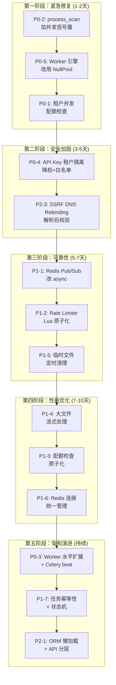

# ScanStruct 系统架构审查报告

**审查人**: 架构师 高见远  
**审查日期**: 2026-06-22  
**审查范围**: 系统架构 / 性能 / 可靠性 / 安全性  
**代码基线**: 06-18 修复 63 个 bug 后的版本  

---

## 目录

- [审查总结](#审查总结)
- [P0 — 架构级隐患](#p0--架构级隐患)
- [P1 — 性能与可靠性问题](#p1--性能与可靠性问题)
- [P2 — 优化空间](#p2--优化空间)
- [修复路线图](#修复路线图)

---

## 审查总结

ScanStruct 经过 63 个 bug 修复后，在业务逻辑层面已相当健壮。但从**系统架构**视角来看，仍存在若干结构性问题：主要集中在 **async/sync 混合模型的资源管理**、**并发控制的原子性缺陷**、**Worker 进程内同步管线**、**Redis 连接碎片化**以及**租户隔离的边界漏洞**。

| 严重级别 | 数量 | 概述 |
|---------|------|------|
| **P0 架构级隐患** | 5 | 可导致数据丢失、租户越权、系统死锁 |
| **P1 性能/可靠性** | 7 | 影响并发吞吐、任务恢复、资源泄漏 |
| **P2 优化空间** | 5 | 可维护性、可扩展性改善 |

---

## P0 — 架构级隐患

### P0-1: Evidence 全流程 Pipeline 缺少租户并发配额检查

| 维度 | 说明 |
|------|------|
| **问题标题** | 证据模块全流程任务跳过租户级并发配额 |
| **风险描述** | `process_evidence_full` 使用 Redis 信号量做**全局**并发控制（`_MAX_CONCURRENT_CASES=3`），但完全**没有检查单租户的 `max_concurrent` 配额**。10 个租户中任何一个都能发起不限数量的并行案件，挤占全局资源，导致其他租户请求饥饿。同时，`create_case` 仅检查了 `max_cases`（案件数量上限），未检查 `max_concurrent`（并发上限）。 |
| **根因分析** | `worker/evidence_tasks.py` L159-180：`try_acquire_case()` 只检查全局计数器，与 `Tenant.max_concurrent` 无关。`api/routes/evidence.py` L229-257：`create_case` 只检查了案件数量。`api/routes/admin.py` L754-761：`get_usage` 虽然计算了 `concurrent_used`，但纯展示用，不强制执行。 |
| **建议方案** | **短期补丁**：在 `process_evidence_full` 中，`try_acquire_case()` 成功后，额外查询 DB 中该租户处于 `processing`/`analyzing`/`exporting` 状态的案件数，超过 `max_concurrent` 则 `self.retry(countdown=60)`。**长期改进**：引入 Redis 分租户并发计数器（`scanstruct:concurrent:tenant:{tenant_id}`），原子化检查。 |

---

### P0-2: Celery Worker 进程内同步管线阻塞——process_scan 无信号量保护

| 维度 | 说明 |
|------|------|
| **问题标题** | `process_scan` 管线缺少并发许可保护，多任务并发可致 OOM |
| **风险描述** | `worker_concurrency=2` 限制 Worker 同时执行 2 个任务。但 `process_scan` 执行的是**重量级管线**：PDF 拆页（200页 × 300DPI = ~2GB 临时图片）、ThreadPoolExecutor 并发增强、PaddleOCR 加载（~800MB 内存）。两个 scan 任务同时跑会瞬间耗尽 4G Worker 内存限制，触发 `worker_max_memory_per_child=300000` 导致 Worker 被 kill，任务进入 `task_reject_on_worker_lost` 重试 → 再次 OOM → 死循环。Evidence 任务用了 `try_acquire_case()` 保护，但 **Scan 任务的 `process_scan` 完全没有调用任何并发控制器**。 |
| **根因分析** | `worker/tasks.py` L43-67：`process_scan` 函数无信号量调用。对比 `worker/evidence_tasks.py` L170-179，evidence 正确使用了 `try_acquire_case()`。两套管线共享同一个 Worker 进程但保护机制不一致。 |
| **建议方案** | **短期补丁**：在 `process_scan` 入口处增加 `try_acquire_case()` 调用（与 evidence 共享计数器），超过上限则 `self.retry(countdown=60)`。**长期改进**：分离 Scan 和 Evidence 到不同 Celery 队列/Worker，各自独立并发控制。 |

---

### P0-3: Celery 消息中间件单队列单 Worker——无水平扩展能力且为单点故障

| 维度 | 说明 |
|------|------|
| **问题标题** | 单 Worker 容器 + 单队列设计，无水平扩展且存在单点故障 |
| **风险描述** | docker-compose 中 `worker` 为单实例容器。`task_acks_late=True` + `task_reject_on_worker_lost=True` 虽然保证了任务不丢（崩溃后重新入队），但：(1) Worker 容器宕机期间所有任务堆积在 Redis 中无人处理；(2) 无法通过 `docker compose scale worker=N` 水平扩展——因为 `process_scan` 使用 `async_session_factory`（全局引擎），多个 Worker 实例间无 DB 连接冲突但 OCR 模型重复加载 N 次浪费内存；(3) Celery beat 定时任务（如临时文件清理）未配置，`_cleanup_tmp_dir` 只在 OCR 任务结束时被调用。 |
| **根因分析** | `docker-compose.yml` L207-254：单 worker 服务。`worker/celery_app.py`：无 Celery beat 配置。`worker/tasks.py` L110：使用全局 `async_session_factory` 而非 `run_in_worker()` 或 `_create_worker_engine()`，与 evidence_tasks 中 `_create_worker_engine()` 的 NullPool 模式不一致。 |
| **建议方案** | **短期补丁**：为 Worker 增加 `deploy.replicas: 1`（明确声明），并配置 `restart: unless-stopped` 保证自动恢复。将 `process_scan` 的 DB 引擎改为 NullPool（与 evidence_tasks 统一）。**长期改进**：引入 Celery beat 定时任务（清理临时文件、检查卡死任务）；考虑 Scan 和 Evidence 拆分为独立 Worker。 |

---

### P0-4: API Key 模式下租户隔离形同虚设

| 维度 | 说明 |
|------|------|
| **问题标题** | API Key 认证注入 `super_admin` 角色，跳过所有租户过滤 |
| **风险描述** | `AuthMiddleware` 在 API Key 认证成功后注入 `request.state.role = "super_admin"`。但 `get_tenant_filter` 仅在 `api_key_mode=True` 时验证 tenant 是否活跃，**不验证 API Key 请求者是否有权操作该租户的数据**。任何持有系统 API Key 的外部系统可以传入任意 `X-Tenant-Id`，以 `super_admin` 权限操作任何租户的案件、证据、用户数据——包括删除其他租户的数据。虽然 API Key 是系统级密钥，但在多租户 SaaS 中，这意味着一个 API Key 泄露 = 全部租户数据泄露。 |
| **根因分析** | `api/middleware.py` L98-109：API Key 模式直接注入 `super_admin`。`api/dependencies.py` L90-118：`get_tenant_filter` 在 API Key 模式下只检查租户存在性，不做授权校验。 |
| **建议方案** | **短期补丁**：为 API Key 增加 IP 白名单或 HMAC 签名校验。将 API Key 模式的角色降为 `tenant_api`（受限角色），仅允许特定操作。**长期改进**：为每个租户生成独立的 API Key（`Tenant.api_key`），替代全局 API Key，实现租户级密钥隔离。 |

---

### P0-5: Scan 任务的 `_run_pipeline` 使用全局 async_session_factory 而非 Worker 专用引擎——Event Loop 绑定冲突

| 维度 | 说明 |
|------|------|
| **问题标题** | `process_scan` 在新建 Event Loop 中使用全局 Session Factory，连接池跨 Loop 绑定导致连接泄漏 |
| **风险描述** | `worker/tasks.py` L302-318 创建新 Event Loop 执行 `_pipeline()`，内部 L110 使用 `async_session_factory`（全局引擎）。全局引擎的 asyncpg 连接池在**首次使用时绑定到创建时的 Event Loop**（即模块导入时的 Loop 或首次 `get_db()` 时的 FastAPI Loop）。在 Worker 的新 Loop 中使用会导致 `"Future attached to a different loop"` 或连接泄漏。注意：代码在 finally 中 `loop.run_until_complete(_db_engine.dispose())` 尝试清理，但这会**dispose 掉全局引擎**——如果 API 和 Worker 在同一进程（开发模式），API 的所有数据库连接都会断开。 |
| **根因分析** | `worker/tasks.py` L110：`from db.session import async_session_factory`，使用全局工厂。对比 `db/session.py` L82-138 中已实现的 `run_in_worker()` 辅助函数（使用 ContextVar 注入 Worker 专用引擎），但 `tasks.py` 完全没有使用它。`complaint_tasks.py` L60-61 同样使用 `async_session_factory` 存在相同问题。 |
| **建议方案** | **短期补丁**：在 `_run_pipeline` 中改用 `_create_worker_engine()` + NullPool 模式（与 evidence_tasks 统一），或使用已有的 `run_in_worker()` 辅助函数。**长期改进**：统一所有 Celery 任务的 DB 访问模式，抽象为 `worker/db_utils.py`，禁止 Worker 任务直接使用全局 `async_session_factory`。 |

---

## P1 — 性能与可靠性问题

### P1-1: Redis Pub/Sub 发布方式为同步调用——在 Worker 进程中会阻塞事件循环

| 维度 | 说明 |
|------|------|
| **问题标题** | `publish_progress` / `publish_result` 使用同步 `redis.Redis` 连接在异步管线中调用 |
| **风险描述** | `stream_publisher.py` 使用 `redis.asyncio.ConnectionPool`，但 `publish()` 方法是 **同步调用**（`r.publish(channel, payload)` 不带 await）。在 `_pipeline()` 的 async 上下文中（L125, 147, 171...），每次进度推送都会**阻塞事件循环**直到 Redis 响应。当 Redis 延迟增加或网络抖动时，整个管线卡住。此外，连接池全局单例在 Worker 新建 Event Loop 中使用也会触发跨 Loop 问题。 |
| **根因分析** | `services/exporter/stream_publisher.py` L49-75：`publish_result` 和 `publish_progress` 均为同步函数，内部调用 `r.publish()` 是同步操作。虽然 `_get_redis()` 返回 `aioredis.Redis`，但 publish 调用没有 await。在 `worker/tasks.py` 中被频繁调用（9个进度推送点）。 |
| **建议方案** | **短期补丁**：将 `publish_progress`/`publish_result` 改为 async 并在调用处 await；或将 Redis 操作放入 `asyncio.to_thread()`。**长期改进**：考虑用 WebSocket/SSE 替代 Redis Pub/Sub 实现前端实时推送（当前 Pub/Sub 无持久化，客户端断开期间消息全丢）。 |

---

### P1-2: LLM Rate Limiter 的 acquire/release 非原子——INCR+EXPIRE 竞态窗口

| 维度 | 说明 |
|------|------|
| **问题标题** | `LLMRateLimiter.acquire()` 的 INCR 和 EXPIRE 非原子，TTL 设置竞态导致信号量泄漏 |
| **风险描述** | `rate_limiter.py` L122-128：`await self.redis.incr(key)` 后检查 `if current == 1: await self.redis.expire(key, PERMIT_TTL)`。INCR 和 EXPIRE 之间如果连接断开，key 已递增但无 TTL → 信号量永久泄漏，计数器永远不归零，最终所有许可被耗尽，LLM 调用全部超时失败。对比 `task_concurrency.py` 中已用 Lua 脚本解决了同样问题（`_LUA_ACQUIRE`），rate_limiter 却没有采用。 |
| **根因分析** | `services/llm/rate_limiter.py` L122-133：两步操作（INCR + 条件 EXPIRE）非原子。`services/utils/task_concurrency.py` L30-41：同样操作用 Lua 脚本原子化。 |
| **建议方案** | **短期补丁**：将 acquire 逻辑改用 Lua 脚本（直接复用 task_concurrency 的 `_LUA_ACQUIRE` 模式）。为每个信号量 key 设置 TTL（而非仅第一个许可时设置），或在 release 时检查是否最后一个并清除 TTL。 |

---

### P1-3: 租户配额并发检查存在 TOCTOU 竞态——Check-then-Act 非原子

| 维度 | 说明 |
|------|------|
| **问题标题** | 案件创建和 Scan 上传的配额检查存在 Check-then-Act 竞态窗口 |
| **风险描述** | `evidence.py` L229-257 `create_case`：先 `SELECT COUNT(*)` 检查案件数，再 `INSERT`。两个并发请求可能同时通过检查，导致超出配额。同样，`scan.py` 的 `_upload_single_file` 的 MD5 去重也是先查后插，并发上传同一文件可能创建重复任务。 |
| **根因分析** | `api/routes/evidence.py` L236-243：COUNT 检查和 INSERT 非原子。`api/routes/scan.py` L240-252：SELECT 和 INSERT 非原子。 |
| **建议方案** | **短期补丁**：在 `tenants` 表增加 `cases_count` 字段并使用 `UPDATE tenants SET cases_count = cases_count + 1 WHERE id = ? AND cases_count < max_cases` 原子操作（利用 PostgreSQL 行锁）。MD5 去重用 `INSERT ... ON CONFLICT (file_md5) DO NOTHING` + 部分唯一索引（已存在 `idx_scan_tasks_md5`）。 |

---

### P1-4: Worker 大文件全量加载到内存——500MB PDF 导致 OOM

| 维度 | 说明 |
|------|------|
| **问题标题** | 扫描件上传和下载均为全量内存加载，大文件并发可致 OOM |
| **风险描述** | `scan.py` L335 `content = await file.read()` 将整个 PDF（最大 500MB）读入内存。`minio_client.download_bytes()` 也全量读取到内存。在 `evidence.py` 的 `upload_materials` 中，每个文件也 `await file.read()` 全量加载。Worker 内存限制 4G，两个 500MB 任务并发处理时仅原始数据就占 2G+，加上 PDF 拆页（200页×300DPI PNG ≈ 2GB）和 OCR 模型（800MB），极易触发 OOM Kill。 |
| **根因分析** | `api/routes/scan.py` L335：`content = await file.read()` 全量读取。`services/storage/minio_client.py` L219-236：`download_bytes` 全量读取。Worker 管线 `worker/tasks.py` L139-143 下载 PDF 后再拆页。 |
| **建议方案** | **短期补丁**：上传时使用 `minio_client.upload_streaming()` 流式上传到 MinIO（已有此方法但未被使用），避免内存全量加载。下载时使用 `download_file` 到临时文件而非 `download_bytes`。**长期改进**：Worker 管线使用基于生成器的流式处理，逐页加载-处理-释放。 |

---

### P1-5: 临时文件清理依赖任务结束——异常退出时 /tmp 堆积

| 维度 | 说明 |
|------|------|
| **问题标题** | Scan 管线工作目录无自动清理，Worker 崩溃后磁盘泄漏 |
| **风险描述** | `worker/tasks.py` L128-129 创建 `work_dir = Path(settings.archive_dir) / "processing" / task_id`，存放拆页图片、OCR 结果等。这些中间文件**仅在 retry 时被清理**（`scan.py` L786-794），正常完成或异常崩溃后**不清理**。200页 PDF 的中间文件约 1-2GB，10 个任务后 `/tmp` 或 `archive_dir` 就会撑满磁盘。Evidence 任务有 `_cleanup_tmp_dir()` 调用，但 Scan 没有。 |
| **根因分析** | `worker/tasks.py` L128-129：创建工作目录但无 finally 清理。`worker/evidence_tasks.py` L39-56：有 `_cleanup_tmp_dir()` 但仅在 OCR 管线结束时调用。无 Celery beat 定时清理。 |
| **建议方案** | **短期补丁**：在 `_run_pipeline` 的 finally 中清理 `work_dir`。**长期改进**：配置 Celery beat 定时任务，每小时清理超过 1 小时的 `processing/` 目录和 `/tmp/ocr_*` 临时文件。 |

---

### P1-6: Redis 连接碎片化——至少 5 处独立创建连接

| 维度 | 说明 |
|------|------|
| **问题标题** | 系统中存在至少 5 处独立创建 Redis 连接，连接池不可控 |
| **风险描述** | 以下位置各自创建 Redis 连接：(1) `stream_publisher.py` L31 `aioredis.ConnectionPool`（async）；(2) `rate_limiter.py` L72 `aioredis.from_url`（async）；(3) `task_concurrency.py` L54 `redis.from_url`（sync）；(4) `batch_processor.py` L38 `redis.Redis.from_url`（sync）；(5) Celery broker 内部连接池。Docker Redis 限制 `maxmemory 128mb`，且 `max_connections=10`（Celery broker），多个独立连接池的连接数叠加可能超过 Redis 容量。 |
| **根因分析** | 全局搜索 `redis.from_url` / `aioredis.from_url` 出现多处，无统一连接管理。 |
| **建议方案** | **短期补丁**：统一同步和异步 Redis 连接为各自的单一连接池（各一个），通过依赖注入传递。**长期改进**：所有 Redis 操作通过统一的 `RedisManager` 管理生命周期，支持健康检查和优雅降级。 |

---

### P1-7: Celery 任务重试的幂等性缺陷——重复处理导致数据不一致

| 维度 | 说明 |
|------|------|
| **问题标题** | Celery `task_acks_late=True` + `task_reject_on_worker_lost=True` 下，任务重试可能重复执行已完成的步骤 |
| **风险描述** | `process_evidence_full` (max_retries=5) 在 Worker 崩溃后重新入队，从头执行 `_do_process_evidence_full`。但 `_run_ocr_pipeline` 查询条件是 `ocr_status.in_(("pending", "failed"))`，已完成的材料（`completed`）会被跳过——这部分是幂等的。但 `_run_classify_pipeline_optimized` 查询 `effective_category.is_(None)` 的材料，如果上次执行中部分材料已分类（`effective_category` 已设置）但后续步骤崩溃，重试时这些材料不会重新分类——**可能遗漏分类更新**。此外 `_create_step` 的 `UniqueConstraint(task_id, step_name)` 在重试时会冲突。 |
| **根因分析** | `worker/evidence_tasks.py` L560-563 OCR 幂等（正确），L929-934 classify 幂等性不完整。`worker/tasks.py` L698-710 `_create_step` 无幂等保护。 |
| **建议方案** | **短期补丁**：在 `_create_step` 中使用 `INSERT ... ON CONFLICT DO NOTHING` 或先检查步骤是否存在。classify 管线重试时应清除 `effective_category` 重新分类。**长期改进**：引入任务级幂等 token（case_id + pipeline_version），执行前检查是否已完成。 |

---

## P2 — 优化空间

### P2-1: EvidenceCase 模型的 `lazy="selectin"` 导致全量加载 N+1 风险

| 维度 | 说明 |
|------|------|
| **问题标题** | EvidenceCase 及关联模型使用 `lazy="selectin"` 全量加载 materials 和 steps |
| **风险描述** | `models_evidence.py` L79-84 `EvidenceCase` 的 `materials` 和 `steps` 关系使用 `lazy="selectin"`，每次查询 case 都自动加载所有材料和步骤。对于有 50+ 材料的案件，每次 `get_case` 返回巨大的 JSON。`list_cases` 虽然用了 `noload()` 绕过，但 `get_case`/`update_case`/`create_case` 都会触发全量加载。 |
| **根因分析** | `db/models_evidence.py` L79-84：`lazy="selectin"`。`db/models.py` L82-87：ScanTask 同样配置。 |
| **建议方案** | 将默认加载策略改为 `lazy="raise"`（显式查询才加载），在需要的地方用 `selectinload()` 显式加载。列表接口只返回摘要字段。 |

---

### P2-2: JWT Token 无服务端失效机制——用户禁用后 Token 仍有效 30 分钟

| 维度 | 说明 |
|------|------|
| **问题标题** | 纯 JWT 无服务端黑名单，禁用用户/暂停租户后旧 Token 仍可用 |
| **风险描述** | `AuthMiddleware` 仅解析 JWT，不检查用户当前状态（`is_active`、`tenant.status`）。用户被禁用或租户被暂停后，其已签发的 access token（30分钟有效）仍可正常访问所有 API。对于医疗法律 SaaS，这意味着被解雇的员工在半小时内仍可下载案件文件。 |
| **根因分析** | `api/middleware.py` L74-86：JWT 解析成功后直接放行，不查询 DB 验证用户/租户状态。`api/dependencies.py` L45-52：`get_current_user` 会检查 `is_active`，但仅在需要 `get_current_user` 的端点生效；`get_tenant_filter` 不检查用户状态。 |
| **建议方案** | **短期补丁**：在 AuthMiddleware 中缓存（Redis，TTL 60s）用户和租户状态，每次请求快速验证。**长期改进**：引入 refresh token 轮换（每次 refresh 时检查状态），access token 缩短到 5-10 分钟。 |

---

### P2-3: SSRF 防护的 DNS Rebinding 风险

| 维度 | 说明 |
|------|------|
| **问题标题** | 回调 URL 的 SSRF 校验仅检查字面 IP，存在 DNS Rebinding 绕过风险 |
| **风险描述** | `scan.py` L370-383 和 `callback.py` L68-80 的 SSRF 校验：先 `urlparse` 检查 hostname，如果 hostname 是 IP 则直接检查是否私有地址。但如果 hostname 是**域名**（如 `evil.com`），则直接放行。攻击者可将 `evil.com` DNS 解析配置为：第一次解析返回公网 IP（通过校验），第二次解析（实际 HTTP 请求时）返回 `169.254.169.254`（云元数据端点）。 |
| **根因分析** | `services/exporter/callback.py` L68-80：注释也承认 "hostname 不是 IP 地址（是域名），允许通过"。`scan.py` L370-383：仅检查字面 hostname 字符串。 |
| **建议方案** | **短期补丁**：在 `send_callback` 中将 hostname 解析为 IP 后再校验（使用 `socket.getaddrinfo`），校验通过后使用解析到的 IP 建立连接。**长期改进**：出站请求通过专用代理（仅允许白名单域名），网络层阻断私有 IP 访问。 |

---

### P2-4: 数据库连接池配置 API 与 Worker 不一致

| 维度 | 说明 |
|------|------|
| **问题标题** | API 连接池大小（10+20）与 Worker 引擎配置不一致 |
| **风险描述** | `db/session.py` L14-21 全局引擎：`pool_size=10, max_overflow=20`（最多 30 连接）。`db/session.py` L113-118 Worker 引擎（`run_in_worker`）：`pool_size=2, max_overflow=2`。`evidence_tasks.py` L63-68 使用 NullPool。PostgreSQL `max_connections=50`（docker-compose）。API 1 个进程最多 30 连接 + Worker 2 个进程各 4 连接 + NullPool 连接 ≈ 38，接近上限。如增加 API Worker 或 Worker 并发，连接数超限。 |
| **根因分析** | 三处引擎配置不统一。 |
| **建议方案** | 统一连接池策略，通过环境变量集中配置。计算 `max_connections = (pool_size + max_overflow) * api_workers + worker_concurrency * worker_pool_size`。 |

---

### P2-5: 日志可能泄露敏感信息

| 维度 | 说明 |
|------|------|
| **问题标题** | 日志中记录了文件名、用户邮箱、案件名称等潜在敏感信息 |
| **风险描述** | 代码中大量 `logger.info(f"... file={filename} ...")`（`scan.py` L295）、`logger.info(f"User created by {current_user.email}"`（`admin.py` L285）。医疗法律 SaaS 中，案件名称可能包含患者姓名，文件名可能包含病历信息。日志文件持久化 30 天（普通）/ 90 天（错误），如被未授权访问则泄露敏感信息。 |
| **根因分析** | 全局未配置日志脱敏过滤器。`config/logging.py` 无敏感字段过滤。 |
| **建议方案** | **短期补丁**：在 loguru 添加 filter，对日志消息中的 email、手机号、身份证号进行正则脱敏。**长期改进**：建立日志审计规范，禁止在日志中输出用户数据内容，仅使用 UUID 引用。 |

---

## 修复路线图

### 详细优先级排序

| 优先级 | 问题编号 | 任务 | 工作量估算 | 依赖 |
|--------|---------|------|-----------|------|
| **1** | P0-2 | `process_scan` 增加并发信号量保护 | 0.5 天 | 无 |
| **2** | P0-5 | Worker DB 引擎统一为 NullPool | 0.5 天 | 无 |
| **3** | P0-1 | 租户并发配额检查（Redis 分租户计数器） | 1 天 | #2 |
| **4** | P1-5 | 临时文件定时清理（work_dir + /tmp） | 0.5 天 | 无 |
| **5** | P1-2 | Rate Limiter 改用 Lua 原子操作 | 0.5 天 | 无 |
| **6** | P0-4 | API Key 降权 + IP 白名单 | 1 天 | 无 |
| **7** | P1-1 | Redis Pub/Sub 改为 async 调用 | 0.5 天 | 无 |
| **8** | P1-7 | Celery 任务幂等性修复（step 幂等 + classify 重置） | 1 天 | #2 |
| **9** | P2-3 | SSRF DNS Rebinding 防护 | 0.5 天 | 无 |
| **10** | P1-3 | 配额检查原子化（DB 行锁 / ON CONFLICT） | 1 天 | 无 |
| **11** | P1-4 | 大文件流式上传/下载 | 2 天 | 无 |
| **12** | P1-6 | Redis 连接统一管理 | 1 天 | #5, #7 |
| **13** | P2-2 | JWT 服务端状态校验（Redis 缓存） | 1 天 | #12 |
| **14** | P0-3 | Worker 水平扩展 + Celery beat | 2 天 | #1, #2 |
| **15** | P2-5 | 日志脱敏过滤器 | 0.5 天 | 无 |
| **16** | P2-1 | ORM 加载策略优化 | 1 天 | 无 |
| **17** | P2-4 | 数据库连接池配置统一 | 0.5 天 | #2 |

---

## 附：系统架构风险热力图

| 模块 | 风险密度 | 主要问题类型 |
|------|---------|-------------|
| `worker/tasks.py` | 🔴 高 | 无并发保护、引擎绑定、无清理 |
| `worker/evidence_tasks.py` | 🟡 中 | 幂等性不完整、Event Loop 管理 |
| `services/llm/rate_limiter.py` | 🟡 中 | 非原子操作、连接管理 |
| `api/middleware.py` | 🔴 高 | API Key 越权、JWT 状态失效 |
| `services/exporter/stream_publisher.py` | 🟡 中 | 同步阻塞、跨 Loop |
| `api/routes/scan.py` | 🟡 中 | 内存全量加载、配额竞态 |
| `api/routes/evidence.py` | 🟢 低 | 配额竞态（影响小） |
| `db/session.py` | 🟡 中 | 引擎碎片化 |
| `docker-compose.yml` | 🟡 中 | 单点故障、资源限制 |
| `config/settings.py` | 🟢 低 | 配置完善 |

---

*报告结束。建议按修复路线图优先处理 P0-2（最高 ROI：0.5 天消除 OOM 死循环风险）和 P0-5（统一引擎消除连接泄漏）。*
